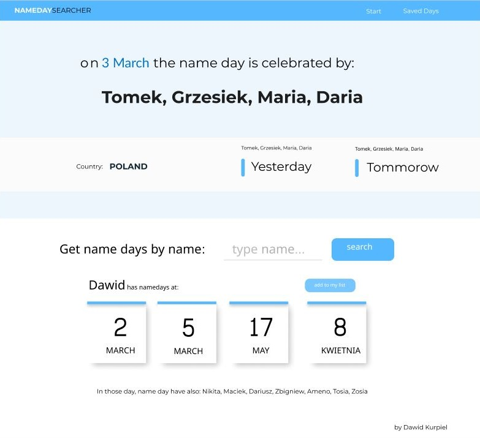
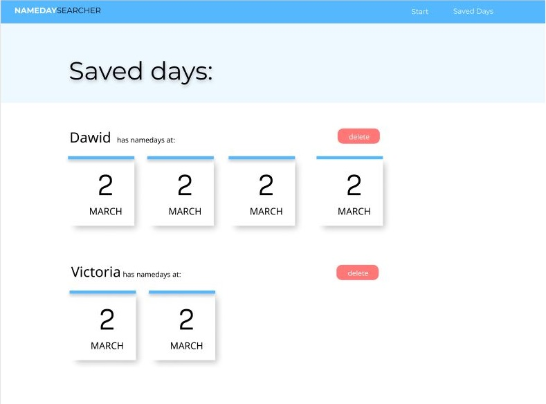

# Name days search

For a recruitment task for the **Albracross** company, I made an application that searches for name days from the public API (https://api.abalin.net).

#### The application allows user to:

- search for name day dates in several countries by date (use calendar)
- shows name days for tomorrow and yesterday for picked country
- search for name day dates in several countries by name
- shows all the names with name day in the same day
- save individual dates
- delete saved dates

## Demo

Here is a working live demo : https://dkurpi.github.io/nameday-app

## Development process

1. Found an **API**, from https://github.com/toddmotto/public-apis
2. Figured out the basic functions of the application and designed a visual look of app in **FIGMA**.

3. Implemented basic functionality without styles.
4. **Refactored** to get clean code and to figure out the best designing patterns for this project.
5. Implemented **context** **API**, **compound** **components**.
6. **Styled** look of the app.
7. Wrote couple **test** for components

## Technologies

- React & Typescript
- Context API for state management
- Styled-components for styling
- Axios for API requests

## Getting Started

2. Go to root directory
1. Run `npm install`
3. Run `npm run start`
4. Open http://localhost:3000 to view it in the browser.
5. Run `npm run test` for tests

The page will automatically reload if you make changes to the code.
You will see the build errors and lint warnings in the console.
